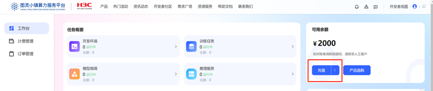
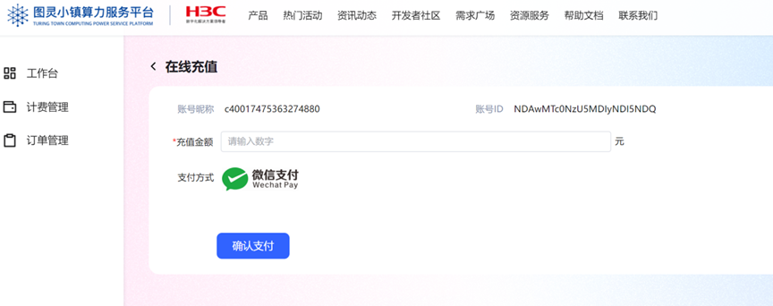
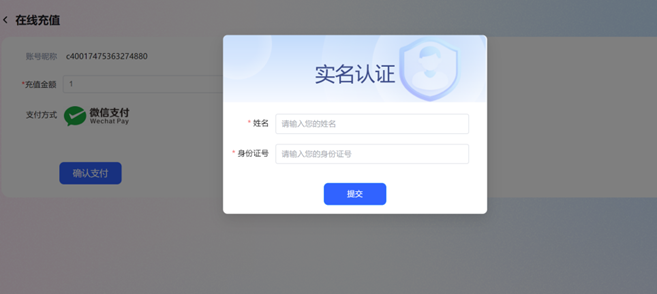
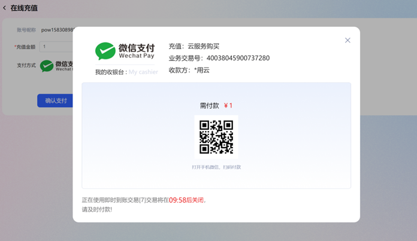
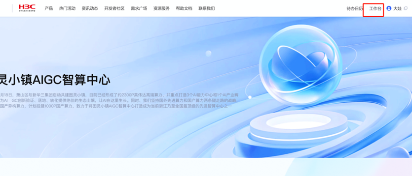
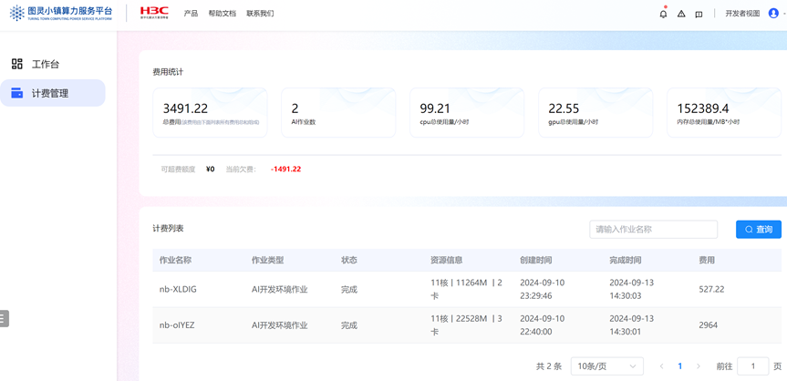

### 1.1.充值说明
网页端在线充值暂时仅支持微信支付，充值金额实时到账。如您是大客户可联系我们享受更多充值折扣。

1. 登录平台

2. 点击右上角【工作台】进入管理界面。

3.输入充值金额，点击确认支付，这里会提示进行实名认证。输入真实的姓名及身份证号，作为唯一的管理员认证信息。认证成功后点击【确认支付】会弹出微信支付二维码进行扫码支付即可。

### 1.2.查看费用账单
1. 登录平台，点击右上角的【工作台】

2. 点击左侧的计费管理进行查看各指标费用的统计，页面下方列表可以按作业名称和使用时间维度进行筛选查看。

普通用户和子账号用户可以查看自己账号下的费用情况。列表可以按作业名称和时间检索。

