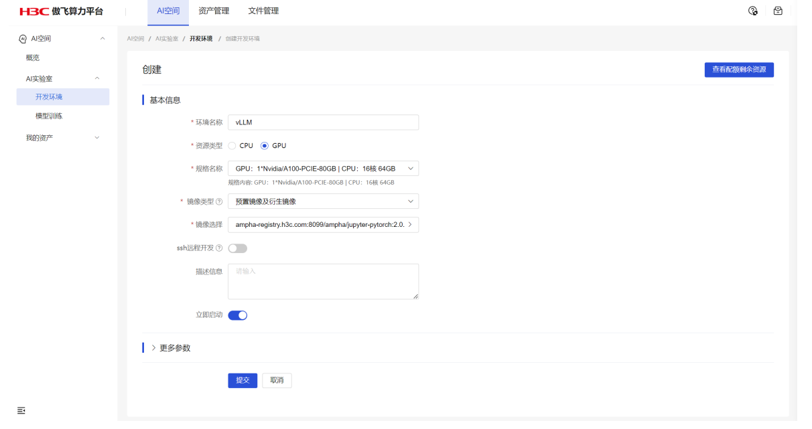
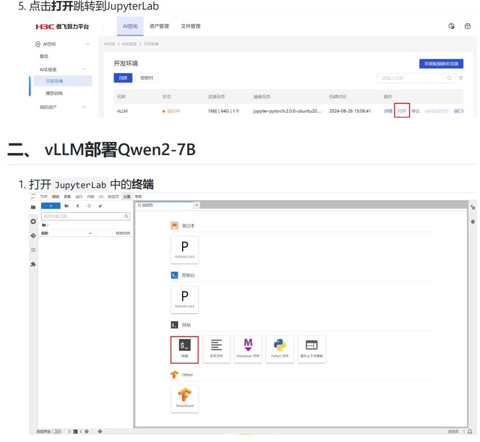
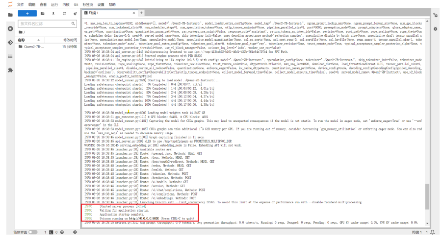
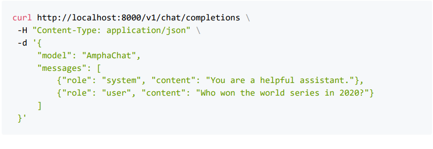
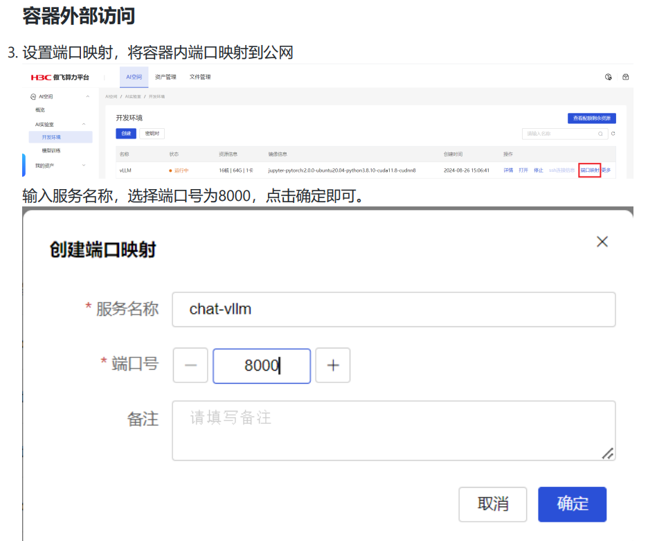
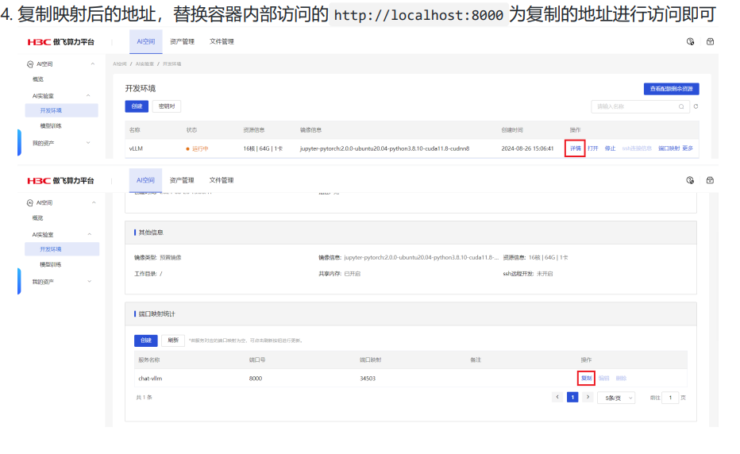

使用vLLM快速部署Qwen2-7B指南

一、环境准备

1. 依次点击AI实验室-开发环境-创建按钮进入开发环境创建的详情页。

2. 输入开发环境的基本信息

3. 环境名称：vLLM

资源类型：GPU

规格名称：GPU：1*Nvidia/A100-PCIE-80GB | CPU：16核 64GB（实际使用可根据具体

需要确定资源规格）

镜像类型： 预置镜像及衍生镜像

镜像选择： ampha-registry.h3c.com:8099/ampha/jupyter-pytorch:2.0.0-ubuntu20.04-

python3.8.10-cuda11.8-cudnn8

ssh远程开发：关闭（本例不使用远程开发，需要使用可打开）

4. 点击提交即可创建开发环境



2、 安装vLLM（0.5.5版本）以及所需依赖
```
apt update && apt install -y build-essential

pip config set global.index-url https://pypi.tuna.tsinghua.edu.cn/simple # 使用清华源

pip install vllm
```

3. qwen/Qwen2-7B-Instruct 模型文件下载

```
pip install modelscope

modelscope download --model qwen/Qwen2-7B-Instruct --local_dir /private/Qwen2-7B Instruct
```

4. vLLM启动 Qwen2-7B-Instruct 推理服务

```
vllm serve ./Qwen2-7B-Instruct/ --trust-remote-code --max_model_len 4096 --served model-name AmphaChat
```

5. 等待服务启动完成即可 启动成功日志如下：


三、访问推理服务

容器内部访问

1. 查询当前服务下运行的模型

```
curl http://localhost:8000/v1/models
```

2. 进行对话请求


